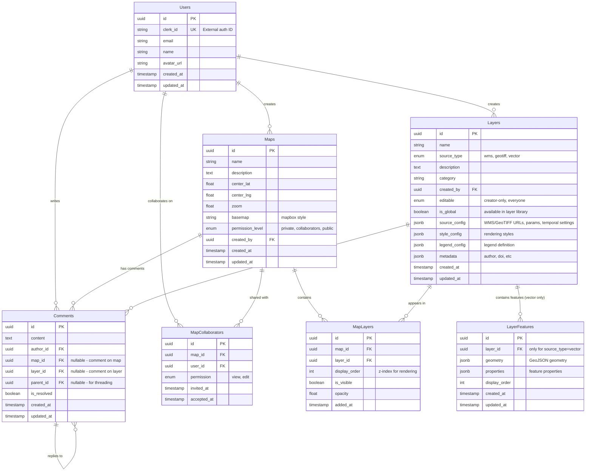

# SamSyn Database Schema

This diagram shows the database design needed to support the SamSyn marine spatial planning application.

## Entity Relationship Diagram



## Key Design Decisions

### 1. **Users Table**
- Stores `clerk_id` to link with Clerk authentication
- Maintains user profile data locally for relationships and queries
- Could be synced from Clerk webhooks

### 2. **Layers Architecture - Three Source Types**

The schema is optimized for the three primary data types: WMS services, GeoTIFF files, and vector polygons.

#### **Source Type: WMS**
External WMS/WMS-T services (e.g., Copernicus Marine, NOAA, oceanographic models)

`source_config` structure:
```json
{
  "url": "https://marine.copernicus.eu/wms",
  "layers": "GLOBAL_ANALYSISFORECAST_PHY_001_024",
  "version": "1.3.0",
  "format": "image/png",
  "transparent": true,
  "temporal": {
    "enabled": true,
    "parameter": "TIME",
    "start": "2020-01-01T00:00:00Z",
    "end": "2024-12-31T23:59:59Z",
    "resolution": "daily"
  },
  "dimensions": {
    "ELEVATION": "-0.5"
  }
}
```

Benefits:
- No data storage needed - service handles everything
- Temporal queries passed directly to WMS-T service
- Can query different depths, variables, etc.

---

#### **Source Type: GeoTIFF**
Raster data files (sea temperature, bathymetry, satellite imagery)

Can be served in two ways:

**Option A: Direct COG rendering** (client-side)
```json
{
  "delivery": "direct",
  "url": "https://storage.marine.gov/datasets/bathymetry_northsea.tif",
  "bounds": [[2.0, 51.0], [8.0, 56.0]],
  "temporal": {
    "enabled": false
  },
  "processing": {
    "colorRamp": "viridis",
    "valueRange": [-200, 0],
    "noDataValue": -9999
  }
}
```

**Option B: TiTiler tile service** (recommended for performance)
```json
{
  "delivery": "tiles",
  "tileServer": "https://titiler.samsyn.io",
  "cogUrl": "https://storage.marine.gov/datasets/bathymetry_northsea.tif",
  "bounds": [[2.0, 51.0], [8.0, 56.0]],
  "temporal": {
    "enabled": false
  },
  "tileParams": {
    "rescale": "-200,0",
    "colormap_name": "viridis",
    "return_mask": true
  }
}
```

For temporal GeoTIFFs (e.g., monthly SST) with TiTiler:
```json
{
  "delivery": "tiles",
  "tileServer": "https://titiler.samsyn.io",
  "cogUrlTemplate": "https://storage.marine.gov/sst/{year}/{month}/sst_{YYYYMM}.tif",
  "temporal": {
    "enabled": true,
    "start": "2020-01-01",
    "end": "2024-12-31",
    "resolution": "monthly"
  },
  "bounds": [[2.0, 51.0], [8.0, 56.0]],
  "tileParams": {
    "rescale": "0,30",
    "colormap_name": "thermal",
    "return_mask": true
  }
}
```

Benefits:
- **Direct COG**: Simple, good for smaller files, uses georaster libraries
- **TiTiler**: Dynamic tiling, better performance, server-side processing
- Files stored in S3/cloud storage (accessible by TiTiler)
- TiTiler handles colormap application, rescaling, band math on-the-fly

---

#### **Source Type: Vector**
User-drawn or uploaded polygons (marine protected areas, fishing zones, study areas)

`source_config` structure:
```json
{
  "geometryType": "Polygon",
  "featureCount": 45,
  "bounds": [[2.5, 51.2], [7.8, 55.9]]
}
```

**Features stored in LayerFeatures table**:
- Individual polygons/points/lines as separate rows
- Enables spatial queries, feature-level editing
- Only source type that uses LayerFeatures table

Benefits:
- Editable by users
- Spatial indexing for queries
- Can handle user annotations, study boundaries, etc.

### 3. **Map-Layer Relationship**
- **MapLayers** junction table enables:
  - Same layer appearing in multiple maps
  - Per-map visibility and opacity settings
  - Layer ordering (z-index) per map
- Supports both:
  - Global layers (in library, `is_global=true`)
  - Map-specific layers (created within a map)

### 4. **Permissions System**
- **Maps**: `permission_level` (private/collaborators/public)
- **Layers**: `editable` (creator-only/everyone)
- **MapCollaborators**: Explicit sharing with view/edit rights
- Enables flexible access control

### 5. **Comments**
- Polymorphic: can target map OR layer
- Self-referential for threading (`parent_id`)
- Includes `is_resolved` for discussion management

### 6. **Temporal Data Handling**

Temporal capabilities are handled differently per source type:

**WMS Layers**:
- Time parameters passed directly to WMS-T service in GetMap requests
- `source_config.temporal.start/end` defines available time range
- Frontend appends `&TIME=2023-06-15T00:00:00Z` to WMS URL
- Service returns the appropriate time slice

**GeoTIFF Layers**:
- Static: Single file URL in `source_config.url`
- Temporal: URL template in `source_config.urlTemplate` with date placeholders
- Frontend resolves template: `sst_{YYYYMM}.tif` → `sst_202306.tif`
- Loads appropriate file based on current time slider position

**Vector Layers**:
- Currently no temporal support (could add temporal snapshots table later if needed)
- Most vector layers are static boundaries/zones

This approach eliminates the TemporalSnapshots table - temporal queries go directly to the data source.

### 7. **JSONB Configuration Fields**

Three separate JSONB fields for clarity:

**`source_config`**: Data source configuration (varies by type)
- WMS: URL, layers, temporal params, dimensions
- GeoTIFF: URL/template, bounds, processing settings
- Vector: Geometry type, feature count

**`style_config`**: Rendering configuration
```json
{
  "stroke": "#3b82f6",
  "strokeWidth": 2,
  "fill": "#3b82f620",
  "pointIcon": "anchor",
  "pointSize": 8
}
```

**`legend_config`**: Legend definition
```json
{
  "type": "gradient",
  "colorStops": [
    {"value": -200, "color": "#0000ff", "label": "-200m"},
    {"value": 0, "color": "#00ffff", "label": "Sea level"}
  ],
  "unit": "meters"
}
```

**`metadata`**: Author, DOI, citations, etc.
```json
{
  "author": "NOAA",
  "doi": "10.5067/GHGMR-4FJ04",
  "citation": "..."
}
```

## Indexes Needed

```sql
-- Users
CREATE INDEX idx_users_clerk_id ON Users(clerk_id);

-- Maps
CREATE INDEX idx_maps_created_by ON Maps(created_by);
CREATE INDEX idx_maps_permission ON Maps(permission_level);

-- Layers
CREATE INDEX idx_layers_created_by ON Layers(created_by);
CREATE INDEX idx_layers_is_global ON Layers(is_global);
CREATE INDEX idx_layers_category ON Layers(category);
CREATE INDEX idx_layers_source_type ON Layers(source_type);

-- LayerFeatures
CREATE INDEX idx_features_layer_id ON LayerFeatures(layer_id);
CREATE INDEX idx_features_geometry ON LayerFeatures USING GIST(geometry);

-- MapLayers
CREATE INDEX idx_map_layers_map ON MapLayers(map_id);
CREATE INDEX idx_map_layers_layer ON MapLayers(layer_id);
CREATE UNIQUE INDEX idx_map_layers_unique ON MapLayers(map_id, layer_id);

-- MapCollaborators
CREATE INDEX idx_collaborators_map ON MapCollaborators(map_id);
CREATE INDEX idx_collaborators_user ON MapCollaborators(user_id);
CREATE UNIQUE INDEX idx_collaborators_unique ON MapCollaborators(map_id, user_id);

-- Comments
CREATE INDEX idx_comments_author ON Comments(author_id);
CREATE INDEX idx_comments_map ON Comments(map_id);
CREATE INDEX idx_comments_layer ON Comments(layer_id);
CREATE INDEX idx_comments_parent ON Comments(parent_id);
```

## Storage Considerations

### WMS Layers (source_type='wms')
- **Zero database storage** for actual data
- Only store service configuration in `source_config`
- Service handles all data delivery and temporal queries
- Best for: Real-time data, large datasets, frequently updated layers

### GeoTIFF Layers (source_type='geotiff')
- **Files stored in S3/cloud storage**
- Database only stores URLs and metadata
- Options:
  - **Static files**: Single URL for non-temporal layers
  - **File collections**: URL template for temporal layers (monthly/daily files)
  - **Cloud-optimized GeoTIFFs (COG)**: Enable partial/tiled reading for performance
- Best for: Raster data, bathymetry, processed satellite imagery

### Vector Layers (source_type='vector')
- **Features stored in LayerFeatures table**
- Each polygon/point/line is a separate row
- PostGIS spatial indexing for fast queries
- Best for: User-drawn boundaries, study areas, annotations
- Typical size: Hundreds to low thousands of features per layer
- For huge vector datasets (10k+ features): Consider vector tiles or external GeoJSON files

## API Endpoints Needed

### Maps
- `GET /api/maps` - List user's maps (owned + shared)
- `GET /api/maps/:id` - Get map with layers
- `POST /api/maps` - Create map
- `PUT /api/maps/:id` - Update map
- `DELETE /api/maps/:id` - Delete map
- `POST /api/maps/:id/layers` - Add layer to map
- `DELETE /api/maps/:id/layers/:layerId` - Remove layer
- `PUT /api/maps/:id/layers/reorder` - Reorder layers

### Layers
- `GET /api/layers` - Get global layer library (filter by source_type)
- `GET /api/layers/:id` - Get layer config
- `POST /api/layers` - Create layer (WMS/GeoTIFF/Vector)
- `PUT /api/layers/:id` - Update layer config
- `DELETE /api/layers/:id` - Delete layer
- `GET /api/layers/:id/features` - Get features (vector layers only, paginated)
- `POST /api/layers/:id/features` - Add features to vector layer
- `PUT /api/layers/:id/features/:featureId` - Update single feature
- `DELETE /api/layers/:id/features/:featureId` - Delete feature

### Collaborators
- `GET /api/maps/:id/collaborators` - List collaborators
- `POST /api/maps/:id/collaborators` - Invite collaborator
- `DELETE /api/maps/:id/collaborators/:userId` - Remove collaborator

### Comments
- `GET /api/comments?mapId=...&layerId=...` - Get comments
- `POST /api/comments` - Create comment
- `PUT /api/comments/:id` - Update comment
- `DELETE /api/comments/:id` - Delete comment

## Technology Recommendations

### Database
- **PostgreSQL with PostGIS extension**
  - Native spatial data types and functions
  - JSONB for flexible schemas
  - Excellent performance for geospatial queries
  - Mature ecosystem

### Backend Framework Options
1. **Node.js + Express + Prisma**
   - Matches frontend (TypeScript)
   - Prisma ORM for type safety
   - Good PostGIS support

2. **Python + FastAPI + SQLAlchemy**
   - Excellent geospatial library ecosystem
   - GeoAlchemy2 for PostGIS
   - Strong data processing capabilities

3. **Go + Fiber + GORM**
   - High performance
   - Good for real-time features
   - Growing geospatial support

### Caching Strategy
- **Redis** for:
  - Session data
  - Frequently accessed layer library
  - Map metadata
  - Comment counts

### File Storage
- **S3/Compatible** for:
  - Large GeoTIFF files
  - Uploaded shapefiles/CSV
  - User avatars
  - Export files

## Migration Path from Frontend

Current frontend state → Backend migration:

1. **Phase 1: User & Auth**
   - Integrate Clerk webhooks to sync users
   - Add user profile endpoints

2. **Phase 2: Maps**
   - Migrate map CRUD operations
   - Add permission checks

3. **Phase 3: Layers**
   - Move layer library to database
   - Implement feature storage
   - Add temporal snapshot queries

4. **Phase 4: Collaboration**
   - Add sharing/collaborators
   - Real-time updates (WebSocket/SSE)

5. **Phase 5: Comments**
   - Migrate comment system
   - Add notifications

## Example Layer Configurations

### Example 1: WMS-T Layer (Sea Surface Temperature)
```json
{
  "id": "layer-sst-copernicus",
  "name": "Sea Surface Temperature - North Sea",
  "source_type": "wms",
  "category": "oceanography",
  "is_global": true,
  "source_config": {
    "url": "https://nrt.cmems-du.eu/thredds/wms/global-analysis-forecast-phy-001-024",
    "layers": "thetao",
    "version": "1.3.0",
    "format": "image/png",
    "transparent": true,
    "temporal": {
      "enabled": true,
      "parameter": "TIME",
      "start": "2020-01-01T00:00:00Z",
      "end": "2024-12-31T23:59:59Z",
      "resolution": "daily"
    },
    "dimensions": {
      "ELEVATION": "0"
    }
  },
  "style_config": {
    "opacity": 0.7
  },
  "legend_config": {
    "type": "gradient",
    "colorStops": [
      {"value": 0, "color": "#0000ff", "label": "0°C"},
      {"value": 10, "color": "#00ffff", "label": "10°C"},
      {"value": 20, "color": "#ffff00", "label": "20°C"},
      {"value": 30, "color": "#ff0000", "label": "30°C"}
    ],
    "unit": "°C"
  },
  "metadata": {
    "author": "Copernicus Marine Service",
    "doi": "10.48670/moi-00016",
    "description": "Daily sea surface temperature from CMEMS global model"
  }
}
```

**Frontend usage**:
```javascript
// User moves time slider to June 15, 2023
const wmsUrl = `${layer.source_config.url}?
  SERVICE=WMS&
  VERSION=1.3.0&
  REQUEST=GetMap&
  LAYERS=${layer.source_config.layers}&
  TIME=2023-06-15T00:00:00Z&
  ELEVATION=0&
  ...`;
```

---

### Example 2: GeoTIFF Layer with TiTiler (Bathymetry)
```json
{
  "id": "layer-bathymetry-northsea",
  "name": "North Sea Bathymetry",
  "source_type": "geotiff",
  "category": "bathymetry",
  "is_global": true,
  "source_config": {
    "delivery": "tiles",
    "tileServer": "https://titiler.samsyn.io",
    "cogUrl": "https://storage.samsyn.io/bathymetry/north_sea_gebco_2023.tif",
    "bounds": [[2.0, 51.0], [8.0, 56.0]],
    "temporal": {
      "enabled": false
    },
    "tileParams": {
      "rescale": "-200,0",
      "colormap_name": "blues",
      "return_mask": true
    }
  },
  "legend_config": {
    "type": "gradient",
    "colorStops": [
      {"value": -200, "color": "#000033", "label": "-200m"},
      {"value": -100, "color": "#000066", "label": "-100m"},
      {"value": -50, "color": "#0066cc", "label": "-50m"},
      {"value": 0, "color": "#66ccff", "label": "0m"}
    ],
    "unit": "meters below sea level"
  },
  "metadata": {
    "author": "GEBCO",
    "doi": "10.5285/e0f0bb80-ab44-2739-e053-6c86abc0289c",
    "year": 2023
  }
}
```

**Frontend usage with TiTiler**:
```javascript
// Generate tile URL
const tileUrl = `${layer.source_config.tileServer}/cog/tiles/{z}/{x}/{y}?` +
  `url=${encodeURIComponent(layer.source_config.cogUrl)}&` +
  `rescale=${layer.source_config.tileParams.rescale}&` +
  `colormap_name=${layer.source_config.tileParams.colormap_name}&` +
  `return_mask=true`;

// Add to Mapbox
map.addLayer({
  id: 'bathymetry',
  type: 'raster',
  source: {
    type: 'raster',
    tiles: [tileUrl],
    tileSize: 256
  }
});
```

---

### Example 3: Temporal GeoTIFF with TiTiler (Monthly Chlorophyll)
```json
{
  "id": "layer-chlorophyll-modis",
  "name": "Chlorophyll-a Concentration (MODIS)",
  "source_type": "geotiff",
  "category": "biological",
  "is_global": true,
  "source_config": {
    "delivery": "tiles",
    "tileServer": "https://titiler.samsyn.io",
    "cogUrlTemplate": "https://storage.samsyn.io/chlorophyll/{year}/{month}/chlor_a_{YYYYMM}.tif",
    "bounds": [[2.0, 51.0], [8.0, 56.0]],
    "temporal": {
      "enabled": true,
      "start": "2020-01-01",
      "end": "2024-12-31",
      "resolution": "monthly"
    },
    "tileParams": {
      "rescale": "0.01,10",
      "colormap_name": "viridis",
      "return_mask": true
    }
  },
  "legend_config": {
    "type": "gradient",
    "colorStops": [
      {"value": 0.01, "color": "#440154", "label": "0.01 mg/m³"},
      {"value": 0.1, "color": "#31688e", "label": "0.1 mg/m³"},
      {"value": 1, "color": "#35b779", "label": "1 mg/m³"},
      {"value": 10, "color": "#fde724", "label": "10 mg/m³"}
    ],
    "unit": "mg/m³",
    "scale": "logarithmic"
  }
}
```

**Frontend usage with TiTiler and temporal data**:
```javascript
// User sets time to March 2023
const currentTime = new Date('2023-03-15');
const year = currentTime.getFullYear();
const month = String(currentTime.getMonth() + 1).padStart(2, '0');
const yyyymm = `${year}${month}`;

// Resolve COG URL from template
const cogUrl = layer.source_config.cogUrlTemplate
  .replace('{year}', year)
  .replace('{month}', month)
  .replace('{YYYYMM}', yyyymm);
// → "https://storage.samsyn.io/chlorophyll/2023/03/chlor_a_202303.tif"

// Generate TiTiler tile URL
const tileUrl = `${layer.source_config.tileServer}/cog/tiles/{z}/{x}/{y}?` +
  `url=${encodeURIComponent(cogUrl)}&` +
  `rescale=${layer.source_config.tileParams.rescale}&` +
  `colormap_name=${layer.source_config.tileParams.colormap_name}&` +
  `return_mask=true`;

// Update map layer source when time changes
map.getSource('chlorophyll').tiles = [tileUrl];
```

---

### Example 4: Vector Layer (Marine Protected Areas)
```json
{
  "id": "layer-mpa-northsea",
  "name": "Marine Protected Areas",
  "source_type": "vector",
  "category": "conservation",
  "is_global": true,
  "editable": "creator-only",
  "source_config": {
    "geometryType": "Polygon",
    "featureCount": 23,
    "bounds": [[2.5, 51.2], [7.8, 55.9]]
  },
  "style_config": {
    "stroke": "#14b8a6",
    "strokeWidth": 2,
    "fill": "#14b8a620",
    "fillOpacity": 0.3
  },
  "legend_config": {
    "type": "categories",
    "categories": [
      {"value": "no-take", "color": "#ff0000", "label": "No-take zone"},
      {"value": "restricted", "color": "#ffaa00", "label": "Restricted fishing"},
      {"value": "managed", "color": "#00ff00", "label": "Managed zone"}
    ]
  }
}
```

**LayerFeatures entries** (in database):
```sql
-- Feature 1: Dogger Bank
{
  "layer_id": "layer-mpa-northsea",
  "geometry": {
    "type": "Polygon",
    "coordinates": [[[2.5, 54.5], [3.5, 54.5], [3.5, 55.5], [2.5, 55.5], [2.5, 54.5]]]
  },
  "properties": {
    "name": "Dogger Bank",
    "protection_level": "no-take",
    "established": "2015",
    "area_km2": 1200,
    "authority": "MMO"
  }
}

-- Feature 2: Frisian Front
{
  "layer_id": "layer-mpa-northsea",
  "geometry": {
    "type": "Polygon",
    "coordinates": [[[4.0, 53.0], [5.0, 53.0], [5.0, 54.0], [4.0, 54.0], [4.0, 53.0]]]
  },
  "properties": {
    "name": "Frisian Front",
    "protection_level": "restricted",
    "established": "2018",
    "area_km2": 850
  }
}
```

**Frontend API call**:
```javascript
GET /api/layers/layer-mpa-northsea/features
→ Returns GeoJSON FeatureCollection with all polygons
```

## TiTiler Integration

### Why TiTiler?

TiTiler is a dynamic tile server for Cloud Optimized GeoTIFFs that provides:

1. **On-the-fly rendering**: No need to pre-generate tile pyramids
2. **Dynamic styling**: Change colormaps, rescale values via URL parameters
3. **Band math**: Compute NDVI, ratios, etc. server-side
4. **Performance**: Reads only needed portions of COG files
5. **Caching**: Can cache tiles at CDN/proxy level

### TiTiler Deployment Options

**Option 1: Self-hosted**
```bash
docker run -p 8000:8000 ghcr.io/developmentseed/titiler:latest
```

**Option 2: AWS Lambda** (recommended for scalability)
- Deploy using TiTiler AWS CDK stack
- Serverless, auto-scaling
- Direct S3 access (no egress costs)

**Option 3: Managed service**
- Terraform Cloud
- Digital Ocean App Platform
- AWS ECS/Fargate

### TiTiler Advanced Features

**Multi-band visualization** (e.g., RGB satellite imagery):
```json
{
  "tileParams": {
    "bidx": "1,2,3",
    "rescale": "0,3000",
    "return_mask": true
  }
}
```

**Band math** (compute indices):
```json
{
  "tileParams": {
    "expression": "(b1-b2)/(b1+b2)",
    "rescale": "-1,1",
    "colormap_name": "RdYlGn"
  }
}
```

**Custom colormaps**:
```json
{
  "tileParams": {
    "colormap": {
      "0": "#0000ff",
      "50": "#00ffff",
      "100": "#ffff00",
      "150": "#ff0000"
    }
  }
}
```

### TiTiler Endpoints Used

- `/cog/tiles/{z}/{x}/{y}` - Get XYZ tile
- `/cog/info` - Get COG metadata (bounds, bands, etc.)
- `/cog/statistics` - Get band statistics for legend generation
- `/cog/preview` - Get preview image for thumbnails

### Backend Helper Endpoints

Your backend can proxy/wrap TiTiler to simplify frontend:

```
GET /api/layers/:layerId/tiles/{z}/{x}/{y}
→ Backend resolves layer config and generates TiTiler URL
→ Returns tile or redirects to TiTiler

GET /api/layers/:layerId/info
→ Proxies to TiTiler /cog/info
→ Returns bounds, resolution, band count

GET /api/layers/:layerId/statistics?time=2023-06-15
→ For temporal layers, resolves time to COG URL
→ Proxies to TiTiler /cog/statistics
→ Used to auto-generate legend min/max values
```

## Scalability Considerations

- **Spatial indexing** on geometry columns for fast vector queries
- **Partition LayerFeatures table** by layer_id for large vector datasets
- **TiTiler with CDN**: CloudFront/Fastly caching of tiles for performance
- **Cloud-optimized GeoTIFFs (COG)**: Essential for TiTiler performance
- **Vector tiles** for very large vector datasets (use PostGIS `ST_AsMVT`)
- **WMS caching** with MapProxy or similar for frequently accessed time slices
- **Read replicas** for query-heavy operations
- **Connection pooling** (PgBouncer) for high concurrency
- **S3 in same region as TiTiler** to minimize latency and transfer costs
